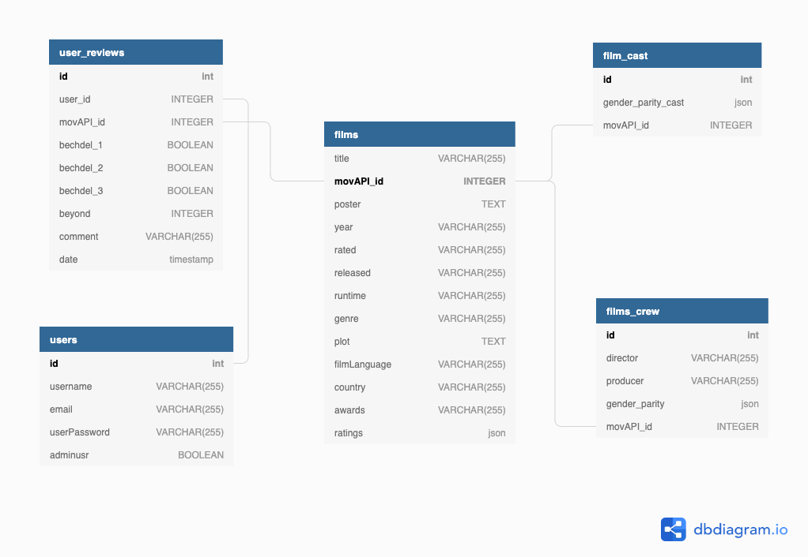

[](https://travis-ci.org/fac19/Bechdel-Beyond-backend) [](https://codecov.io/gh/fac19/Bechdel-Beyond-backend)

# Bechdel and Beyond REST API

An REST API where you can get film details such as `title, poster, year, runtime, genre, plot, language, country, awards, ratings from Internet Movie Database, Rotten Tomatoes and Metacritic`, indication if it passes the `Bechdel test`, its `beyond score` (measure of audience satisfaction with the gender repsentation on screen - to learn more visit [Bechdel and Beyond](https://bandb.netlify.app/) app) and the gender split of its `crew` and `cast`. It is also possible to sign up/sign in to submit your own Bechdel test and beyond reviews.

Student project implemented over weeks 11-13: design week | build sprint 1 | build sprint 2

**Disclaimer**

This MVP production database is limited to the first 18 films from 1997 available from the [api used](#apis-used) due to space constraints in our server.

## Contributors

- Scrum Master: [James](https://github.com/jamesj-0)
- UX/UI Lead: [Chloe](https://github.com/Chloeh24)
- DevOps Lead: [Ako](https://github.com/akomiqaia)
- QA Lead: [Gio](https://github.com/glrta)

## Install

1. clone the repo
2. in your terminal run `npm i`
3. create a `.env` file in the root folder with the following inside:

```env
PGDATABASE=bbdev
PGUSER=myuser
PGPASSWORD=mypassword
SECRET=mysecret
```

4. change your terminal to `psql` or `pgcli` environment
5. To setup a super user run following commands. if you have one already you can skip running this code in `psql` environment.

```sql
CREATE USER myuser WITH PASSWORD 'mypassword';
ALTER USER myuser WITH SUPERUSER;
```

6. If you are having issues with anything related to accessing the databases you have created, you may need to grant privileges:

```sql
GRANT ALL PRIVILEGES ON DATABASE bbdev TO myuser;
GRANT ALL PRIVILEGES ON ALL TABLES IN SCHEMA public TO myuser;
```

7. Initialise the dev and test databases:

```sql
CREATE DATABASE bbdev WITH OWNER myuser;
CREATE DATABASE bbtest WITH OWNER myuser;
\c bbdev;
\i database/init.sql;
\c bbtest;
\i database/init.sql;
```

Bear in mind that in our `package.json` runs tests from `bbtest` database and names in the `"test"` script and database have to match.

**Scripts**

- Run tests: `npm run test`

- Start server: `npm run dev`

- Optional: `npm run fetch` if you wish to populate your bbdev database with more data (can be skipped if you just intend to test the api). The script will run `fetch.js` which makes fetch requests to different APIs and gather resources that are used in the production database. Contact one of us to get keys for the two APIs and include them in your `.env` file like so: 
```
APIKEYTMDB=key
APIKEYOMDB=key
```

## Usage

### Database schema



### Bechdel API routes

The base URL for the api endpoints is: `https://apibechdel.herokuapp.com/`

#### Users

| Path      | Method | Body                                                              | Example response                                                                    |
| --------- | ------ | ----------------------------------------------------------------- | ----------------------------------------------------------------------------------- |
| `/signup` | `POST` | `{ "email: "gio@gio.com", "username": "gio", "password": "123" }` | `{ "id": 1, "email": "gio@gio.com", "username": "gio", "access_token": "ey5a..." }` |
| `/login`  | `POST` | `{ "email": "gio@gio.com", "password": "123" }`                   | `{ "id": 1, "email": "gio@gio.com", "username": "gio""access_token": "ey5a..." }`   |

<!--May need to add PUT and DELETE routes for user reviews/account details -->

#### Films

| Path           | Method | Body | Example response                                                                                                                                                                                                                                                                                                                                                                                                                                                                                                   |
| -------------- | ------ | ---- | ------------------------------------------------------------------------------------------------------------------------------------------------------------------------------------------------------------------------------------------------------------------------------------------------------------------------------------------------------------------------------------------------------------------------------------------------------------------------------------------------------------------ |
| `/films`       | `GET`  | n/a  | `[{"title": "Titanic", "movapi_id": "34"..."}, {"title": "star wars: episode iv - a new hope", "movapi_id": "12"..."}, ...]`                                                                                                                                                                                                                                                                                                                                                                                       |
| `/film/:title` | `GET`  | n/a  | `[{ "title": "Titanic", "movapi_id": "34", "poster": "https://m.media-amazon.com/images...", "year": "1997", "rated": "PG-13", "runtime": "194min", "genre": "["drama", "romance"]", "plot": "A seventeen-year-old aristocrat falls in love with...", "filmLanguage": "English", "country": "USA", "awards": "Won 11 oscars and another 114 wins", "ratings":"72"` |

#### Reviews (Bechdel and beyond)

| Path                   | Method | Body                                                                                                                                                             | Example response                                                                                                                                                   |
| ---------------------- | ------ | ---------------------------------------------------------------------------------------------------------------------------------------------------------------- | ------------------------------------------------------------------------------------------------------------------------------------------------------------------ |
| `/film/:title/reviews` | `GET`  | n/a                                                                                                                                                              | `[{ "user_id": "1", "film_id": "1", "bechdel_1": "true", "bechdel_2": "false", "bechdel_3": "false", "beyond": "3", "comment": "I loved it!"}, {"user_id": 5...}]` |
| `/film/:title/reviews` | `POST` | `[{ "user_id": "1", "film_id": "1", "bechdel_1": "true", "bechdel_2": "true", "bechdel_3": "true", "beyond": "3", "comment": "I loved it!"}, {"user_id": 5...}]` |                                                                                                                                                                    |
| `/user/:id/reviews`    | `GET`  | n/a                                                                                                                                                              | `[{ "film_id": "1", "bechdel_1": "true", "bechdel_2": "false", "bechdel_3": "false", "beyond": "3", "comment": "I loved it!"}, {"film_id": "5"...}]`               |

#### Cast and crew

| Path                | Method | Body | Example response                                                                                                                                             |
| ------------------- | ------ | ---- | ------------------------------------------------------------------------------------------------------------------------------------------------------------ |
| `/film/:title/crew` | `GET`  | n/a  | `{"id": 1, "director": "James", "assistant_director": "Ako", "producer": "Gio", "gender_parity": {"male": 2, "female": 3, "notlisted": 34},"movapi_id": 34}` |
| `/film/:title/cast` | `GET`  | n/a  | `{"id": 16, "gender_parity_cast": {"male": 51, "female": 27, "notlisted": 38} "movapi_id": 597}`                                                             |

## Acceptance criteria

- [x] As a user I want to register and log in
- [x] As a User I want to get details of a list of films
- [x] As a user I want to get film ratings from other known sources
- [x] As a user I want to get information if film passes the Bechdel Test or not
- [x] As a user I want to get information about the gender split on screen and behind the scenes
- [x] As a user I want to be able to post my review regarding Bechdel test and beyond score
- [x] As a user i want to be able to get all my contributions

**Strech goals**

- [ ] As a user I want to be able to edit/delete my account details
- [ ] As a user I want to get informaiton about which platform I can watch a chosen film
- [ ] As a user I want to be able to delete/edit my reviews

## APIs used

- [The Movie DB API](https://www.themoviedb.org/documentation/api) was used to get a list of films. Search was done by year and 1997 was selected since Titanic was always comming up in our search for APIs to use.
- [The Movie Open Database](http://www.omdbapi.com/) was used to get film details for a given film title
- [The Movie DB API](https://www.themoviedb.org/documentation/api) was used again to get cast and crew information for a given film id (provided by the first query)
- [Bechdel Test Movie List](https://bechdeltest.com/api/v1/doc) was used to get Bechdel test reviews for a given film title

## Technologies

Node.js</br>
Express

Deployment: Heroku</br>
CI: Travis</br>
Testing: Tape, Supertest and Codecov</br>
Management: Jira
